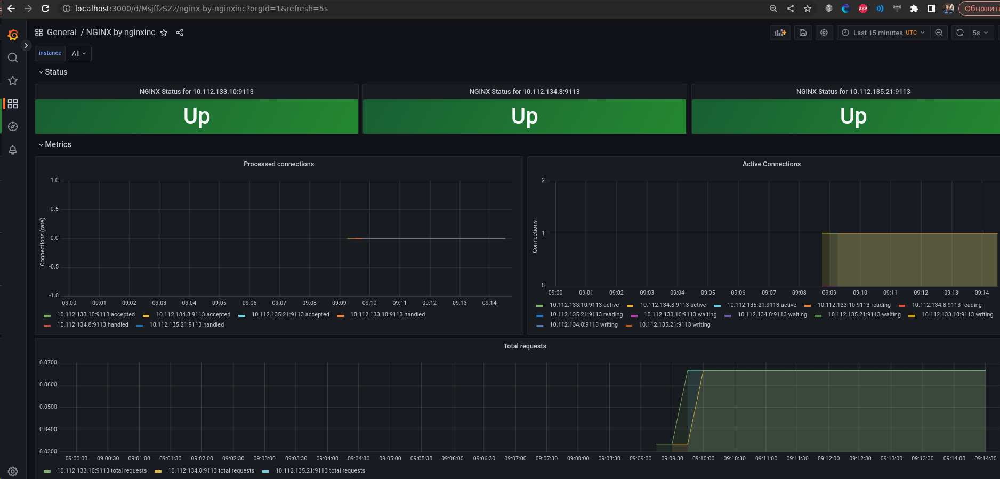

# Выполнено ДЗ №9 
## Домашнее задание. GitOps и инструменты поставки

 - [x] Основное ДЗ
 - [ ] Задание со *

## Обзор

Для выполнения данного домашнего задания Вам необходимо создать кастомный образ nginx (Базовый образ не важен). Который
по определенному пути будет отдавать свои метрики. Далее Вам необходимо использовать nginx exporter который будет 
преобразовывать эти метрики в формат понятный prometheus. Установка в один или разные ns роли не играет. Установка в 
один или разные поды роли не играет.

Создайте дополнительную ветку kubernetes-monitoring. Результаты ДЗ должны находить в директории kubernetes-monitoring.

## В процессе сделано:

Будем ставить prometheus-operator при помощи helm3.

Выполнение задания:
1. Подготовка k8s кластера в yandex-cloud
    ```bash
    yc managed-kubernetes cluster create k8s-otus \
    --network-id "enp02k4ifo4p5ndu0d15" \
    --zone "ru-central1-b" \
    --subnet-id "e2l3a8ho8nun654f6bee" \
    --public-ip \
    --release-channel REGULAR \
    --version 1.24 \
    --node-service-account-name k8s-node-group-pm1 \
    --service-account-id "ajebdf109kiq85a9v9ks" \
    --cloud-id "b1g7vl9ofg6pq269b87f" \
    --folder-id "b1g4eqcgv9u4pfhp54tt"
   
    yc managed-kubernetes node-group create node-1 \
    --cluster-name k8s-otus \
    --fixed-size 4 \
    --platform standard-v2 \
    --core-fraction 5 \
    --preemptible \
    --public-ip \
    --memory 4 \
    --cores 2 \
    --disk-size 60 \
    --disk-type network-hdd \
    --version 1.24 \
    --cloud-id "b1g7vl9ofg6pq269b87f" \
    --folder-id "b1g4eqcgv9u4pfhp54tt"
   
    yc managed-kubernetes cluster get-credentials k8s-otus --external --force --folder-id b1g4eqcgv9u4pfhp54tt
    kubectl get nodes -o wide
    ```
   Получили следующую конфигурацию сервера:
   ```text
   NAME                        STATUS   ROLES    AGE     VERSION   INTERNAL-IP   EXTERNAL-IP      OS-IMAGE             KERNEL-VERSION      CONTAINER-RUNTIME
   cl1b8hpouqnvtsqnqvk3-adob   Ready    <none>   2m19s   v1.24.8   10.129.0.25   158.160.7.190    Ubuntu 20.04.5 LTS   5.4.0-139-generic   containerd://1.6.18
   cl1b8hpouqnvtsqnqvk3-akix   Ready    <none>   5m23s   v1.24.8   10.129.0.38   84.252.143.195   Ubuntu 20.04.5 LTS   5.4.0-139-generic   containerd://1.6.18
   cl1b8hpouqnvtsqnqvk3-iqel   Ready    <none>   5m20s   v1.24.8   10.129.0.14   158.160.14.140   Ubuntu 20.04.5 LTS   5.4.0-139-generic   containerd://1.6.18
   cl1b8hpouqnvtsqnqvk3-iqyx   Ready    <none>   78s     v1.24.8   10.129.0.27   158.160.13.157   Ubuntu 20.04.5 LTS   5.4.0-139-generic   containerd://1.6.18
   ```
   Установка Prometheus (ставим через Helm):
   ```bash
   helm repo add prometheus-community https://prometheus-community.github.io/helm-charts
   helm repo update prometheus-community
   helm install prometheus prometheus-community/prometheus
   ```
   ```text
   NAME: prometheus
   LAST DEPLOYED: Sun Jun  4 10:40:26 2023
   NAMESPACE: default
   STATUS: deployed
   REVISION: 1
   TEST SUITE: None
   NOTES:
   The Prometheus server can be accessed via port 80 on the following DNS name from within your cluster:
   prometheus-server.default.svc.cluster.local
   
   
   Get the Prometheus server URL by running these commands in the same shell:
     export POD_NAME=$(kubectl get pods --namespace default -l "app=prometheus,component=server" -o jsonpath="{.items[0].metadata.name}")
     kubectl --namespace default port-forward $POD_NAME 9090
   
   
   The Prometheus alertmanager can be accessed via port  on the following DNS name from within your cluster:
   prometheus-%!s(<nil>).default.svc.cluster.local
   
   
   Get the Alertmanager URL by running these commands in the same shell:
     export POD_NAME=$(kubectl get pods --namespace default -l "app=prometheus,component=" -o jsonpath="{.items[0].metadata.name}")
     kubectl --namespace default port-forward $POD_NAME 9093
   #################################################################################
   ######   WARNING: Pod Security Policy has been disabled by default since    #####
   ######            it deprecated after k8s 1.25+. use                        #####
   ######            (index .Values "prometheus-node-exporter" "rbac"          #####
   ###### .          "pspEnabled") with (index .Values                         #####
   ######            "prometheus-node-exporter" "rbac" "pspAnnotations")       #####
   ######            in case you still need it.                                #####
   #################################################################################
   
   
   The Prometheus PushGateway can be accessed via port 9091 on the following DNS name from within your cluster:
   prometheus-prometheus-pushgateway.default.svc.cluster.local
   
   
   Get the PushGateway URL by running these commands in the same shell:
     export POD_NAME=$(kubectl get pods --namespace default -l "app=prometheus-pushgateway,component=pushgateway" -o jsonpath="{.items[0].metadata.name}")
     kubectl --namespace default port-forward $POD_NAME 9091
   
   For more information on running Prometheus, visit:
   https://prometheus.io/
   ```
   Самым простым способом выполнения задачи является установка Helm-чарта Bitnami с включенным параметром 
   metrics.enabled, после чего все начинает работать:
   ```bash
   helm install nginx oci://registry-1.docker.io/bitnamicharts/nginx --set metrics.enabled=true
   ```
   ```text
   NAME: nginx
   LAST DEPLOYED: Sun Jun  4 11:17:34 2023
   NAMESPACE: default
   STATUS: deployed
   REVISION: 1
   TEST SUITE: None
   NOTES:
   CHART NAME: nginx
   CHART VERSION: 15.0.1
   APP VERSION: 1.25.0
   
   ** Please be patient while the chart is being deployed **
   NGINX can be accessed through the following DNS name from within your cluster:
   
       nginx.default.svc.cluster.local (port 80)
   
   To access NGINX from outside the cluster, follow the steps below:
   
   1. Get the NGINX URL by running these commands:
   
     NOTE: It may take a few minutes for the LoadBalancer IP to be available.
           Watch the status with: 'kubectl get svc --namespace default -w nginx'
   
       export SERVICE_PORT=$(kubectl get --namespace default -o jsonpath="{.spec.ports[0].port}" services nginx)
       export SERVICE_IP=$(kubectl get svc --namespace default nginx -o jsonpath='{.status.loadBalancer.ingress[0].ip}')
       echo "http://${SERVICE_IP}:${SERVICE_PORT}"
   ```
   Способ более соответствующий ДЗ - пишем манифесты для nginx, добавляем отсутствующие CRD, применяем все содержимое:
   ```bash
   cd ./kube-prometheus-0.12.0
   # Create the namespace and CRDs, and then wait for them to be available before creating the remaining resources
   # Note that due to some CRD size we are using kubectl server-side apply feature which is generally available since kubernetes 1.22.
   # If you are using previous kubernetes versions this feature may not be available and you would need to use kubectl create instead.
   kubectl apply --server-side -f manifests/setup
   kubectl wait \
   --for condition=Established \
   --all CustomResourceDefinition \
   --namespace=monitoring
   kubectl apply -f manifests/
   ```
   ```bash
   kubectl apply -f ./nginx
   ```
   Скриншот Grafana:
   

## PR checklist:
 - [x] Выставлен label с темой домашнего задания
