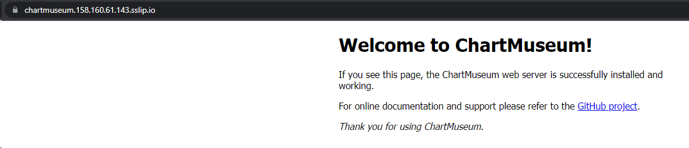
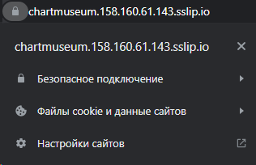
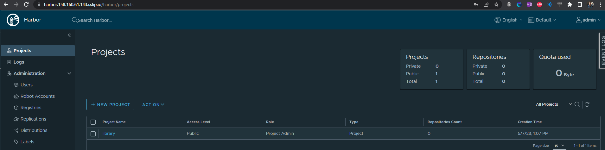
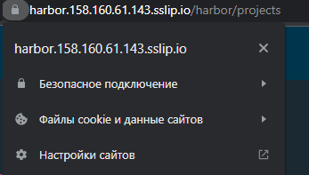
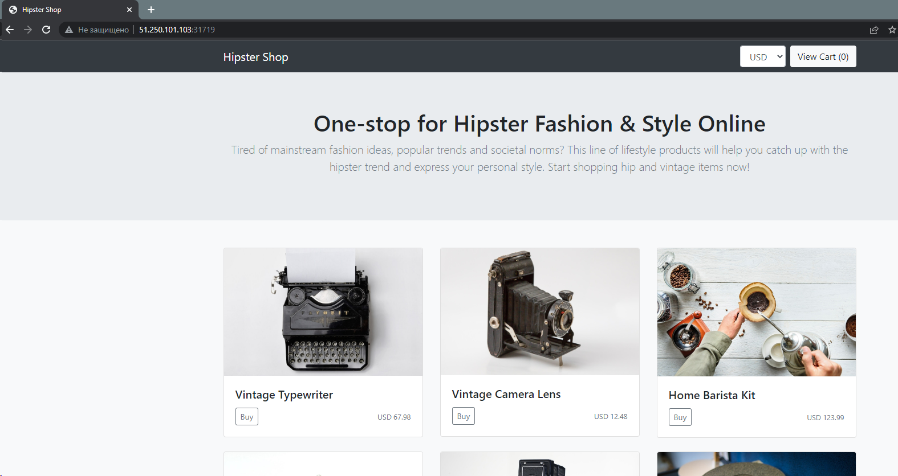

# Выполнено ДЗ №1

 - [x] Основное ДЗ
 - [ ] Задание со *

## В процессе сделано:
### Основное задание
1. Подъём кластера k8s - вручную в Яндекс.Облаке
    ```bash
    yc managed-kubernetes cluster list
    ```
    ```
    +----------------------+------+---------------------+---------+---------+-----------------------+--------------------+
    |          ID          | NAME |     CREATED AT      | HEALTH  | STATUS  |   EXTERNAL ENDPOINT   | INTERNAL ENDPOINT  |
    +----------------------+------+---------------------+---------+---------+-----------------------+--------------------+
    | cat0h30oja5opb0ltfv4 | k8s  | 2023-04-15 07:45:40 | HEALTHY | RUNNING | https://158.160.0.140 | https://10.129.0.9 |
    +----------------------+------+---------------------+---------+---------+-----------------------+--------------------+
    
    ikomar@ikomar-server:~/PycharmProjects/ikomar-ru_platform/kubernetes-templating$ kubectl cluster-info
    Kubernetes control plane is running at https://158.160.0.140
    CoreDNS is running at https://158.160.0.140/api/v1/namespaces/kube-system/services/kube-dns:dns/proxy
    
    To further debug and diagnose cluster problems, use 'kubectl cluster-info dump'.
    ```
2. Установлен helm
    ```bash
    helm version
    ```
    ```
    version.BuildInfo{Version:"v3.10.1", GitCommit:"9f88ccb6aee40b9a0535fcc7efea6055e1ef72c9", GitTreeState:"clean", GoVersion:"go1.18.7"}
    ```
3. Установлен ingress-nginx. Версия в ДЗ устаревшая, использую актуальную 4.6.0
    ```bash
    kubectl create ns nginx-ingress
    helm repo add ingress-nginx https://kubernetes.github.io/ingress-nginx
    helm repo update ingress-nginx
    helm upgrade --install ns ingress-nginx/ingress-nginx --namespace=nginx-ingress --version="4.6.0"
    kubectl get services -n nginx-ingress
    ```
    ```
    NAME                                    TYPE           CLUSTER-IP      EXTERNAL-IP      PORT(S)                      AGE
    ns-ingress-nginx-controller             LoadBalancer   10.96.145.137   158.160.61.143   80:32457/TCP,443:31240/TCP   46s
    ns-ingress-nginx-controller-admission   ClusterIP      10.96.204.81    <none>           443/TCP                      46s
    ```
4. Установлен Cert-manager. Версия в ДЗ устаревшая, использую актуальную 1.11.1
    ```bash
    # CRD
    kubectl apply -f https://github.com/cert-manager/cert-manager/releases/download/v1.11.1/cert-manager.crds.yaml
    # Cert-manager
    helm install cert-manager jetstack/cert-manager --namespace cert-manager --create-namespace --version v1.11.1
    helm list --all-namespaces
    ```
    ```
    NAME                    NAMESPACE       REVISION        UPDATED                                 STATUS          CHART                   APP VERSION
    cert-manager            cert-manager    1               2023-05-07 11:59:19.42037855 +0300 MSK  deployed        cert-manager-v1.11.1    v1.11.1    
    ni                      nginx-ingress   1               2023-05-07 11:03:27.017325422 +0300 MSK deployed        ingress-nginx-4.6.0     1.7.0      
    ```
    ```bash
    # acme-issuer
    kubectl apply -f cert-manager/acme-issuer.yaml
    ```
5. Установлен chartmuseum. Версия в ДЗ устаревшая, использую актуальную 3.9.3
    ```bash
    # фиксирую ip
    yc vpc address update --id e9b8temldf3n40ek31jh --reserved
    yc vpc address list
    ```
    ```
    +----------------------+------+----------------+----------+------+
    |          ID          | NAME |    ADDRESS     | RESERVED | USED |
    +----------------------+------+----------------+----------+------+
    | e2l17rukphnievn4280u |      | 51.250.99.24   | false    | true |
    | e2l845m91o1ghe989f66 |      | 62.84.120.183  | false    | true |
    | e2lho44uighguslbqa24 |      | 51.250.101.103 | false    | true |
    | e9b8temldf3n40ek31jh |      | 158.160.61.143 | true     | true |
    +----------------------+------+----------------+----------+------+
    ```
    ```bash
    # фиксирую ip
    kubectl create ns chartmuseum
    helm repo add chartmuseum https://chartmuseum.github.io/charts
    helm repo update chartmuseum
    helm upgrade --install chartmuseum-release chartmuseum/chartmuseum  --wait  --namespace=chartmuseum   --version 3.9.3 -f chartmuseum/values.yaml
    helm ls -n chartmuseum
   ```
   ```
   NAME                    NAMESPACE       REVISION        UPDATED                                 STATUS          CHART                   APP VERSION
   chartmuseum-release     chartmuseum     1               2023-05-07 11:42:09.503242625 +0300 MSK deployed        chartmuseum-3.9.3       0.15.0    
   ```
    Итоги:
   + Chartmuseum доступен по адресу https://chartmuseum.158.160.61.143.sslip.io/

       
   + Сертификат получен

       

6. Установлен harbor
    ```bash
    # фиксирую ip
    kubectl create ns harbor
    helm repo add harbor https://helm.goharbor.io
    helm repo update harbor
    helm upgrade --install harbor harbor/harbor --wait --namespace=harbor --version=1.12.0 -f ./harbor/values.yaml
    helm ls -n harbor
    ```
    ```
    NAME    NAMESPACE       REVISION        UPDATED                                 STATUS          CHART           APP VERSION
    harbor  harbor          1               2023-05-07 13:06:49.320197028 +0300 MSK deployed        harbor-1.12.0   2.8.0 
    ```
   Итоги:
   + Harbor доступен по адресу  https://harbor.158.160.61.143.sslip.io/
    
     
   + Сертификат получен
    
     

7. Создаём свой helm-чарт
   ```bash
   helm create hipster-shop
   rm ./hipster-shop/values.yaml
   rm -rf ./hipster-shop/templates/*
   wget https://raw.githubusercontent.com/express42/otus-platform-snippets/master/Module-04/05-Templating/manifests/all-hipster-shop.yaml -O ./hipster-shop/templates/all-hipster-shop.yaml
   kubectl create ns hipster-shop
   helm upgrade --install hipster-shop-release hipster-shop --namespace hipster-shop
   kubectl get services -n hipster-shop
   ```
   ```
   NAME                    TYPE        CLUSTER-IP      EXTERNAL-IP   PORT(S)        AGE
   adservice               ClusterIP   10.96.130.149   <none>        9555/TCP       4m42s
   cartservice             ClusterIP   10.96.246.23    <none>        7070/TCP       4m43s
   checkoutservice         ClusterIP   10.96.218.212   <none>        5050/TCP       4m43s
   currencyservice         ClusterIP   10.96.210.13    <none>        7000/TCP       4m42s
   emailservice            ClusterIP   10.96.143.0     <none>        5000/TCP       4m43s
   frontend                NodePort    10.96.211.144   <none>        80:31719/TCP   4m42s
   hipster-shop            ClusterIP   10.96.191.83    <none>        80/TCP         4m43s
   paymentservice          ClusterIP   10.96.255.253   <none>        50051/TCP      4m42s
   productcatalogservice   ClusterIP   10.96.186.38    <none>        3550/TCP       4m43s
   recommendationservice   ClusterIP   10.96.184.24    <none>        8080/TCP       4m42s
   redis-cart              ClusterIP   10.96.153.162   <none>        6379/TCP       4m42s
   shippingservice         ClusterIP   10.96.220.233   <none>        50051/TCP      4m43s
   ```
   Веб-интерфейс доступен
   

8. Выносим frontend
   ```
   helm create frontend
   rm -rf frontend/templates
   rm -f frontend/values.yaml
   ```
   После переустановки доступ исчез.
   Устанавливаем frontend
   ```bash
   helm upgrade --install frontend frontend --namespace hipster-shop
   ```
   Доступ снова есть.
   Далее шаблонизировали параметры чарта `frontend`: 
   + счетчик реплик
   + все порты
   
   Добавил frontend как зависимость hipster-shop.
   ```bash
   helm dep update hipster-shop
   helm ls -A
   ```
   ```text
   NAME                    NAMESPACE       REVISION        UPDATED                                 STATUS          CHART                   APP VERSION
   cert-manager            cert-manager    1               2023-05-07 12:21:03.322043029 +0300 MSK deployed        cert-manager-v1.11.1    v1.11.1    
   chartmuseum-release     chartmuseum     1               2023-05-07 12:45:51.69226086 +0300 MSK  deployed        chartmuseum-3.9.3       0.15.0     
   harbor                  harbor          1               2023-05-07 13:06:49.320197028 +0300 MSK deployed        harbor-1.12.0           2.8.0      
   hipster-shop-release    hipster-shop    7               2023-05-10 08:29:58.954600015 +0300 MSK deployed        hipster-shop-0.1.0      1.16.0     
   ns                      nginx-ingress   1               2023-05-07 12:42:36.421330819 +0300 MSK deployed        ingress-nginx-4.6.0     1.7.0  
   ```
   Проверяем работу шаблонизации и правильность создания всех ресурсов:
   ```bash
   helm upgrade --install hipster-shop-release hipster-shop -n hipster-shop --set frontend.service.NodePort=31234
   kubectl get svc -n hipster-shop -l app=frontend
   ```
   ```text
   NAME       TYPE       CLUSTER-IP     EXTERNAL-IP   PORT(S)        AGE
   frontend   NodePort   10.96.145.33   <none>        80:32224/TCP   12m
   ```
   Загрузим образы в harbor
   ```bash
   helm package frontend
   helm package hipster-shop
   helm plugin install https://github.com/chartmuseum/helm-push
   helm registry login https://harbor.158.160.61.143.sslip.io/ -u admin -p Harbor12345
   helm push frontend-0.1.0.tgz oci://harbor.158.160.61.143.sslip.io//otus-kuber
   helm push hipster-shop-0.1.0.tgz oci://harbor.158.160.61.143.sslip.io//otus-kuber
   ```
## PR checklist:
 - [x] Выставлен label с темой домашнего задания


